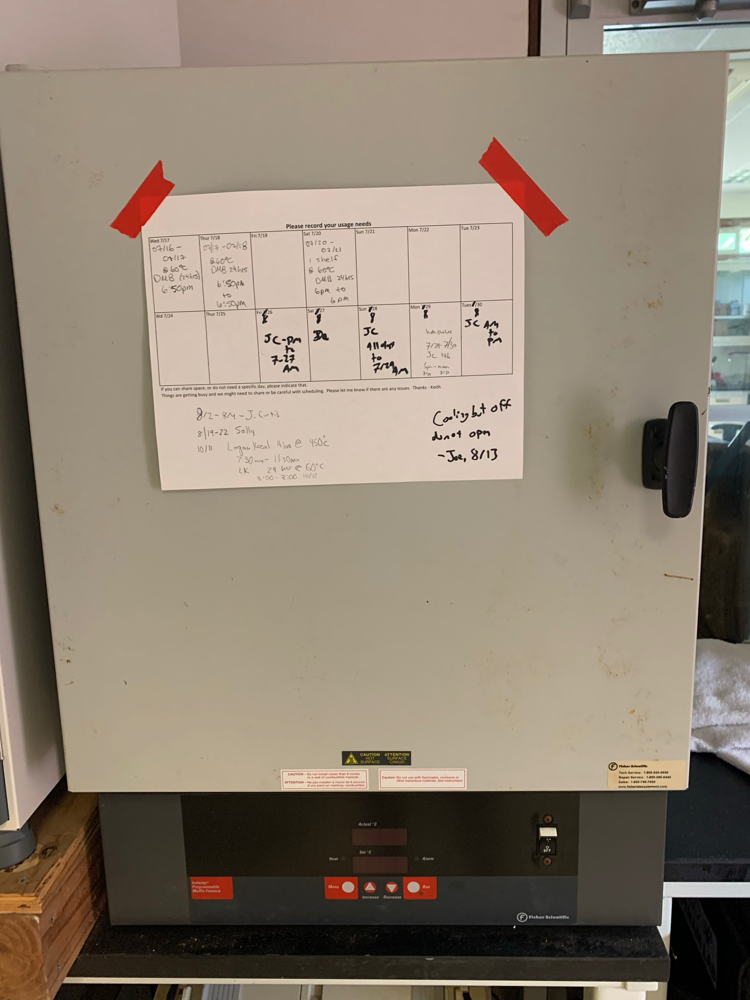
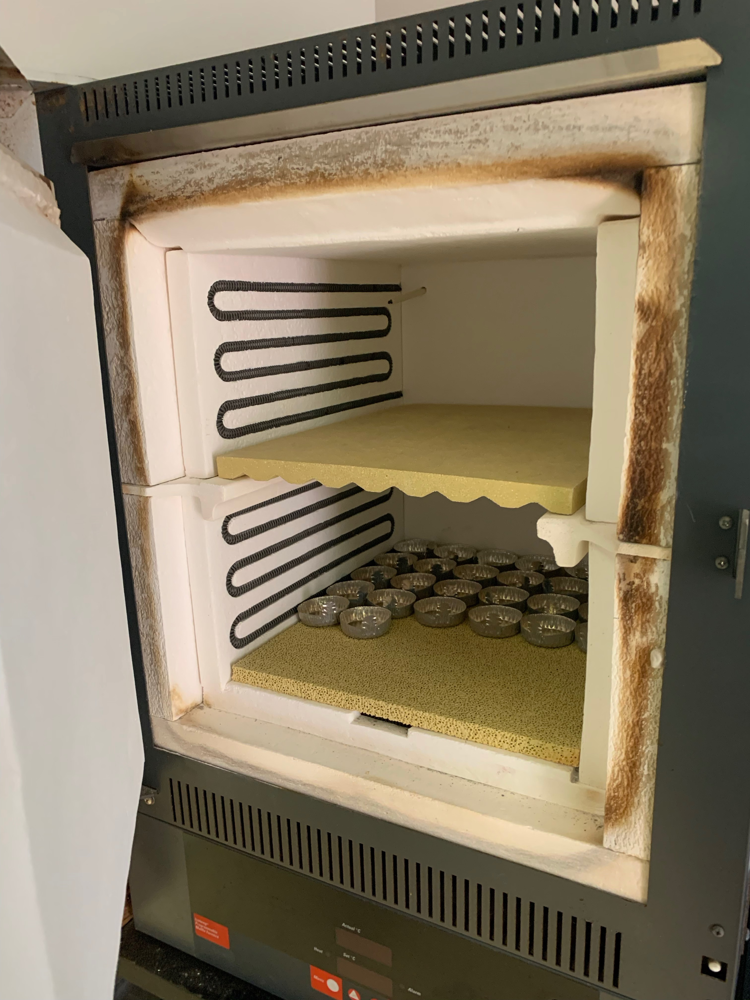

# Standard protocol for ash-free dry weight 

Original: 20190131    
Last Revised: 20200101  

Contents  
- [**Materials**](#Materials)    
- [**Protocol**](#Protocol)  
- [**Table**](#Table)  
- [**References**](#References)  
 
1.  **Materials**
    - 	Aluminum pans
    - 	Drying oven (60°C) *(in LTER lab)*
    - 	Muffle furnace (450°C) *(in LTER lab)*
    - 	Analytical balance (0.0001 g) *(in LTER lab)*
    -  15 mL falcon tubes
    -  5 mL pipet and tips
    -  Centrifuge with rotors for 15 mL falcon tubes *(in LTER lab)*

2.  **Protocol**

    1.  Obtain aluminum weigh pans to be used in AFDW determination
    2.  Label each pan with an ID number. May use a spatula to scrape a # into bottom of pan, or use pencil. Marker WILL burn off!
    3.  After labeling, burn in the muffle furnace at 450°C for 4-6 h (some papers use 500°C for 4 or 6). 
    	    - Turn on muffle furnace
	    - If Run light is on, press once to turn off
	    - Press Menu: screen should read 'NO PROG'
	    - Press Up arrow: screen should read 'YES PROG'
	    - Press Run. If blinking, press Run again.  
    4. 	After, remove from the muffle furnace, place in a glass desiccator and transport to the scale room.
	*Take care after this point that pans are not touched without gloves on, and that pans are ALWAYS sat on burned aluminum foil on tabletops and in ovens/furnaces/scales*
    5.  Record weight of burned pans on 4-decimal place scale (= “C” in Table 1.) Make sure you are using clean gloves or tweezers to weight the pans.
    6.  Keep pans in desiccator until used
    7. Remove frozen tissue homogenate from freezer and thaw.
    8. Vortex tissue homogenate and pipet 5 mL (use 5mL pipet) into a 15-mL falcon tube.
    9. Centrifuge the 15-mL tubes (in LTER lab) for 3 min. (0.03 on display) at 3500 min-1.
    10. Line cafeteria trays with aluminum foil and fill with empty pre-burned pans, using tweezers to transfer pans.
    11. After centrifuging 15-mL tubes, pipet 4 mL of supernatant (host fraction) into a pre-burned pan. Record the pan number used for each sample, and indicate in notebook that this is the host fraction for that sample.
    12. Discard the remaining <1 mL of supernatant, being careful not to lose the pellet.
    13. Resuspend the symbiont pellets in 15-mL tubes with 1 mL 1xPBS. Use 5-mL pipet to break up symbiont pellet and transfer **all** of the liquid into another pre-burned pan. Record pan number and sample ID in notebook, indicating that this is the symbiont fraction.
    14. Transfer trays of filled pans to drying oven at 80°C for at least 24 h. (If 80°C oven is not available, use 60°C drying oven).
    15. Weigh dried pans. Should be “at constant weight”. Preliminary steps may be needed to ensure samples have reached a constant weight. Leaving samples in drying oven longer than 24 h may be necessary, and is not detrimental.
    16.  After samples have reached a constant weight, weigh pan + dried samples on a 4- decimal scale and record weight (= “D” in Table 1.)
    17.  After recording the weight of the burned pan + dry tissue (and salts), place in the muffle furnace at 450°C for 4-6 h. 
	    - Turn on muffle furnace
	    - If Run light is on, press once to turn off
	    - Press Menu: screen should read 'NO PROG'
	    - Press Up arrow: screen should read 'YES PROG'
	    - Press Run. If blinking, press Run again.  
Most literature uses a 6h burn period, but in preliminary tests of blastate 4h is sufficient to burn off the well dispersed (high SA of blastate in pans) residue. Oven also stays hot after turning off, so even at 4h (30 ramp up, 30 min ramp down + residual heat in oven…) the oven will be hot for some time.
	*NOTE: The organic fraction will burn off at 450°C leaving only salt and inorganics behind. The difference between the dry weight and burned weight is the organic fraction of biomass.*
    18.  Let pans cool and place in desiccator and transport to the scale. Avoid transporting when warm, it will cause water to adhere to pans.
    19.  Measure weight of burned pan + burned tissue (“D” – “F” in Table 1.). This is the AFDW of the organic fraction
    20.  The AFDW will be biomass (g) for each mL of tissue added, which will then be normalized by the total homogenate volume and skeletal surface area.    
3.  **Table**

	Table 1. Example calculations:
	
 A  | B  | C  | D  | E  | F  |  G |
----|----|----|----|----|----|----|
Sample ID | Sample volume (mL) | Burned pan (g) | Burned pan + Dry residue (g) | Dry tissue biomass (g) | Burned pan + burned residue (g) | AFDW (g/mL) |
Calculations | | | | = D-C | | = (D-F)/B |
Ex. 1 | 4.0 | 4.5632 | 4.8005 | 0.237 | 4.7542 | 0.011575 |

## Muffle furnace

4.  **References**

    1.  Fitt et al., 2000. Seasonal patterns of tissue biomass and densities of symbiotic dinoflagellates in reef corals and relation to coral bleaching. Limnol. Oceanogr., 45(3), 2000, 677–685
    2.  Schoepf et al., 2013. Coral Energy Reserves and Calcification in a High-CO2 World at Two Temperatures. PLoS ONE 8: e75049

	  
   

	  
   

